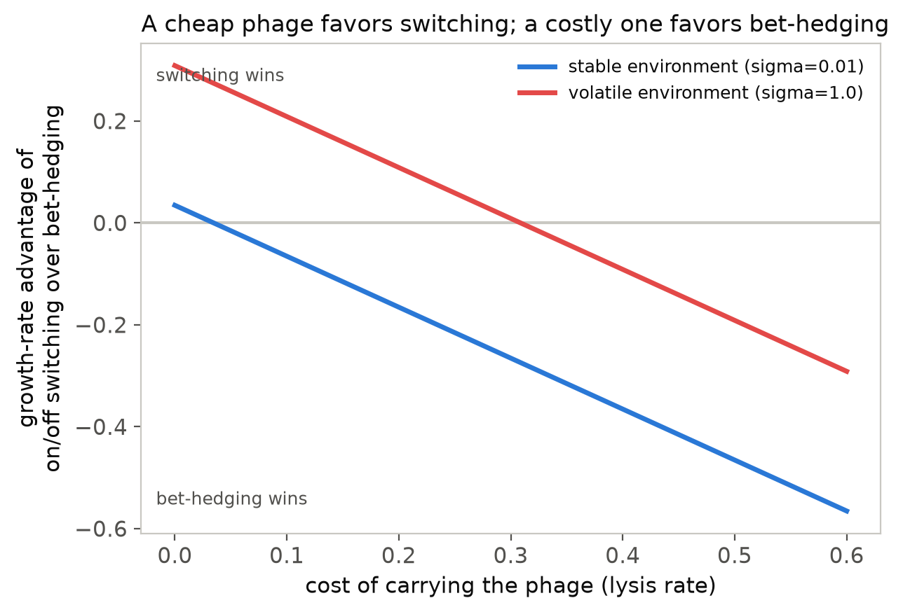
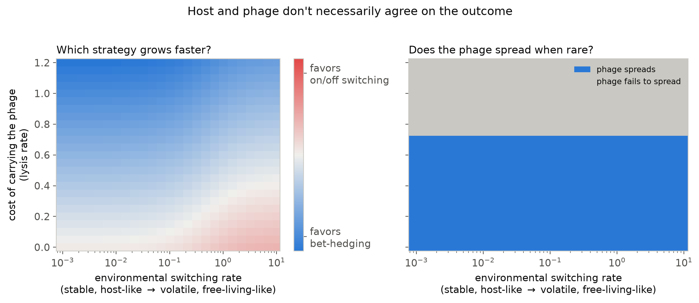

# Executive Summary: When does bet-hedging lose to an on/off switch?

*Theory-modeling side of the project — companion to Jeffrey's genomic survey in
`jeffrey/SUMMARY.md`. Full math in `derivation.md`; the model's code lives in
`lib/`, `sim/`, `sweeps/`. No new experimental data went into this — it's a
theoretical exploration meant to generate testable predictions, not a fit to
measurements.*

## The question

Carey et al. (2018, 2019) showed that *E. coli* normally hedges its bets: under
aerobic growth, cells randomly vary how much TMAO-respiration machinery (torCAD)
they make, so a few cells are always ready if oxygen suddenly runs out. The HK022
phage disables this — lysogens switch torCAD cleanly off when aerobic and on when
anaerobic, with none of the cell-to-cell randomness.

That raises two questions this model tries to answer:

1. **Under what conditions would a bacterium actually benefit** from giving up
   the hedge for a clean switch?
2. **Does the phage benefit too** — or could this be something the phage
   maintains for its own reasons, at the host's expense?

We built a mathematical model — not a lab experiment — that computes, for a given
set of conditions, which strategy would out-grow the other, *and separately*
whether the phage would successfully spread if introduced at low numbers. We
deliberately never combine those into one score: it's entirely possible for the
bacterium to benefit while the phage doesn't, or vice versa, and that gap is
part of the answer, not something to average away.

## What the model actually is (plain-language version)

We simulate two competing bacterial strategies:

- **Bet-hedging** (no phage): a small, fixed fraction of cells stay "prepared"
  (aerobic torCAD on) at any moment. Prepared cells pay a small growth penalty for
  making machinery they don't need yet; unprepared cells that get caught by a
  sudden switch to no-oxygen conditions stall badly.
- **On/off switching** (HK022 lysogen): torCAD tracks oxygen directly and
  uniformly, no randomness, no waiting to catch up — but the phage can also lyse
  (burst and kill) its host, possibly more or less often depending on conditions.

We then ask, across a range of environments — from very stable (few, rare
oxygen swings, roughly what a resident gut/urinary-tract bacterium might see) to
very volatile (frequent swings) — and a range of "how costly is it to carry this
phage," which strategy actually grows faster, and whether the phage itself would
spread.

## Finding 1: the cost of carrying the phage is a major, clean lever

This is the cleanest result. Holding the environment fixed, as the phage becomes
more costly to carry (more frequent lysis), the advantage flips from favoring
on/off switching to favoring bet-hedging — and it doesn't take much: even a
modest lysis cost is enough to erase the switching benefit, in both a stable and
a volatile environment (blue vs. red line). **This isn't currently measured for
HK022** — the 2018 paper couldn't detect a cost of aerobic torCAD expression
either, so both the "switching benefit" and "lysis cost" numbers in this figure
are illustrative, chosen to be reasonable rather than fit to data. But the shape
of the result is robust to the exact numbers: *how much the phage costs its host
matters as much as, or more than, how stable the environment is.*

## Finding 2: host and phage don't always want the same thing

Left panel shows which strategy wins for the bacterium itself (blue = bet-hedging,
red = switching); switching is favored most strongly in the bottom-right corner —
cheap phage *and* a volatile environment. Right panel shows, over the *same*
grid, whether the phage successfully spreads when introduced at low numbers
(blue = yes). These are computed independently, and one thing stands out
immediately: **the right panel's boundary is a flat horizontal line** — in this
version of the model, whether the phage spreads depends only on the lysis rate,
not at all on how often the environment changes. That's a real property of how
we built this piece (it uses each strategy's long-run average growth rate,
which only depends on the *fraction of time* spent in each condition, not on how
fast the environment happens to flip between them) — worth knowing if the
pattern looks suspiciously clean, and a natural target for a future, more
detailed version of the model.

The more important point is what happens when the two panels disagree — the
host would benefit from switching, but the phage's continued spread doesn't
hinge on that benefit at all, or vice versa. That's exactly the situation your
comparative-genomics work (`jeffrey/SUMMARY.md`) is already hinting at: **some
of the same regulatory disruption is achieved by plain IS elements/transposons,
with no lysis risk at all.** If a host can get the same benefit without
carrying a phage, that's a reason to suspect the phage-mediated cases persist
more because it suits the *phage* to maintain its own integration site, not
because bacteria are specifically selecting for a phage to do this job.

## A surprising, unresolved wrinkle — flagging this honestly

Naively, you'd expect: stable environment → switching wins; volatile
environment → bet-hedging wins. The model's actual behavior on the
"environmental volatility" axis is more subtle than that, and we want to be
upfront about it rather than round it off.

In the model, whether bet-hedging helps depends on whether the fraction of
cells that stay "prepared" is well-matched to how often the environment
actually changes. We set that fraction to roughly match what's been observed in
the lab (~10% of cells prepared under aerobic growth). If we then ask the model
"what if the environment changed much faster than that," the fixed 10% hedge
turns out to be a *bad* match for a fast-changing environment — and
counter-intuitively, the model shows switching becoming *more* favored as
volatility increases, not less, purely because the hedge wasn't built for that
pace of change.

We think this is a real, interesting model behavior, not a bug — but it also
means "volatile environments favor bet-hedging" isn't something we can currently
claim with confidence; it depends on assumptions about whether/how the hedge
fraction itself would adapt to a different pace of environmental change, which
isn't something we've modeled yet. **A useful experimental check**: if you
imposed artificially fast aerobic/anaerobic cycling on non-lysogens (much
faster than typical rapid-depletion assays), would the ~10% prepared fraction
still look adaptive, or would something closer to a deterministic response
start to win in direct competition? That would directly test this part of the
model.

## What's assumed vs. measured (please push back on these)

Nothing below has been measured for this system; we chose illustrative values
and checked that the qualitative story doesn't depend sensitively on the exact
numbers. If any of these are wrong by an order of magnitude, tell us — that's
exactly the kind of input that would sharpen the model:

- **Cost of making unneeded torCAD machinery** — the 2018 paper looked for this
  directly and couldn't detect it in competition assays, so we used a small
  value.
- **How often oxygen availability actually flips**, in a real host-associated
  vs. free-living niche — not measured; this is literally the axis the whole
  "in-host vs. free-living" hypothesis rests on.
- **How often HK022 spontaneously lyses its host**, and whether that rate
  depends on oxygen at all — not measured; we treat it as a free parameter and
  show results across a range.
- **How fast a cell's expression state can switch** — this one *is* pinned
  down (thanks to your input): roughly 20 minutes, about one bacterial
  generation. That's fast enough that standard bet-hedging theory's usual
  simplifying assumptions (that phenotypes are stable across several
  generations) don't cleanly apply here — we built the model to handle that
  explicitly rather than assume it away (see `derivation.md` for the technical
  detail, and `NOTES.md` for a running list of every such assumption).

## Bottom line

The phage's cost to its host is the most robust lever in the model — a cheap
phage favors switching, a costly one favors bet-hedging, regardless of the
environment. Whether environmental stability itself favors one strategy over
the other is real but more subtle than expected, and depends on whether the
bacterium's hedge is well-matched to the actual pace of change. And Jeffrey's
finding that non-phage elements can achieve the same regulatory rewiring is a
good reason to keep host benefit and phage benefit as separate questions, which
is exactly how this model is built to answer them.
