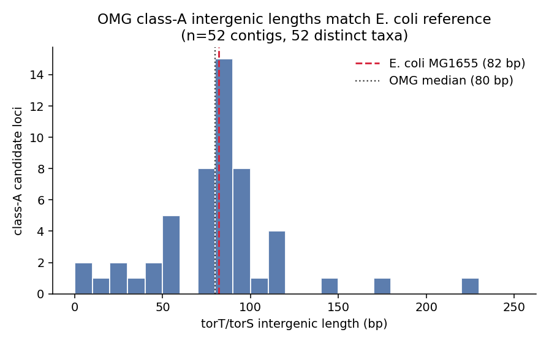
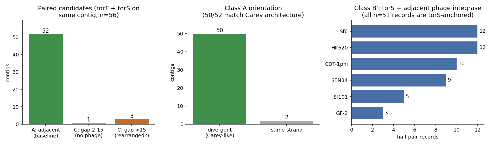
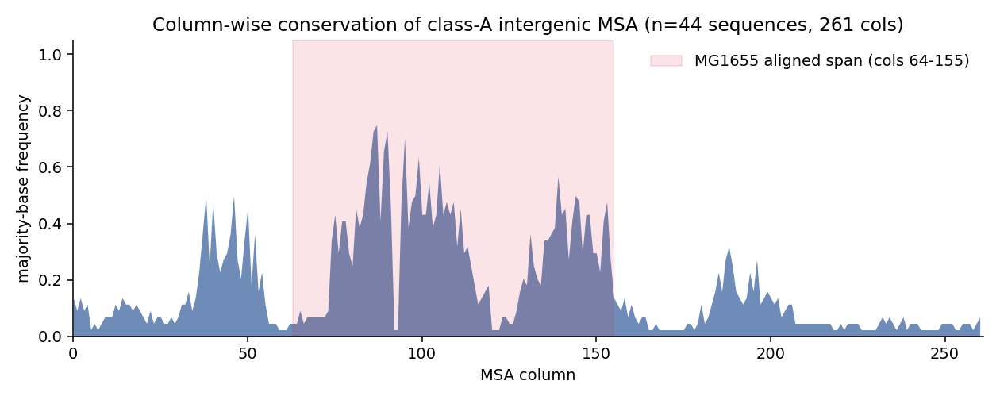

# Pilot: mmseqs search for Carey-analog divergent promoter architectures

*Dustin Mullaney, 2026-07-30. Branch `mmseqs-promoter-search`.*

## Question

Carey et al. (2019) showed that in *E. coli*, phages of the HK022 family
integrate into the intergenic region between two divergently transcribed,
co-regulated genes (*torT* and *torS*) — splitting a shared promoter and
rewiring TMAO respiration. Is this a one-off, or a recurring "trick" that
phages use across bacterial metagenomes to modulate host gene expression?

## Approach

Using two protein queries (MG1655 *torT*, *torS*) and one integrase per
phage listed in Carey's Supp 1 (11 phages), we searched a 90%-clustered
protein database of ~10M representative CDS from the Open Metagenome
(OMG) corpus with MMseqs2 (v13, CPU on gizmo `short`, ~15 min per query
set). Hit headers `omg_row<N>_cds<M>` were then used to reconstruct
gene-order synteny per contig, and to pull the actual intergenic DNA
from the source OMG Arrow shards.

Contigs where torT and torS hits co-occur were classified into three
architectures based on CDS gap and any intervening integrase hits:

- **A** — adjacent (gap = 1), baseline intact system.
- **B** — anchor pair separated by ≥1 CDS *including* an integrase hit
  (Carey-analog phage-interrupted architecture).
- **C** — anchor pair separated by many CDS with no phage signature
  (likely rearrangement or misassembly).

Contigs with only one anchor plus an adjacent integrase were tracked
separately as **B′** (half-pair candidates — the partner may have been
lost off the end of a truncated contig).

## Key findings

### 1. Class-A intergenic lengths match the *E. coli* reference precisely



Across 52 distinct OMG contigs where both torT and torS homologs sit
adjacent (one per taxon), the intergenic length distribution centers on
**80 bp** — essentially identical to *E. coli* K-12 MG1655's actual
82 bp reference (chr:1056179..1056260). This tight match is the single
strongest signal that we are recovering the true Carey-analog architecture
in metagenomes, not chance co-occurrence of unrelated proteins.

### 2. Orientation and class distribution are consistent with Carey



- **52 of 56 paired candidates (93%)** show the adjacent, intact
  architecture (class A). Only 1 has a small-gap insertion (2-15 CDS,
  no phage) and 3 have very large gaps (likely rearranged or false
  pairs).
- **50 of 52 class-A pairs (96%)** are transcribed divergently — the
  canonical Carey orientation with the shared promoter between them.
- **B′ half-pair records: 51**, all torS-anchored, spread across
  six phage families. This is a strong reminder that our torS query
  picks up the whole hybrid sensor-kinase superfamily; the specific
  torS ortholog signal is being diluted (see caveats below).

### 3. Promoter-DNA sequence is conserved at Carey-canonical positions



MAFFT MSA of the 43 class-A intergenic sequences (length-filtered 50-200 bp)
plus the *E. coli* MG1655 reference. Column-wise majority-base frequency
shows the strongest conservation peaking inside the MG1655 aligned span
(cols 64-155, shaded), with the highest peaks around cols 85-95. Manual
inspection of that region reveals the motif `tctagca` at the same
alignment column in MG1655 and multiple OMG contigs (e.g. rows 7135772,
8556429), plus a shared `ggttg...agt` block just upstream — plausibly the
divergent −10-element pair for the shared promoter.

### 4. Zero class B in the pilot — but see caveats

We found **no** contig with both torT and torS *and* an integrase between
them in this pilot. Two competing interpretations:

- **The Carey mechanism is rare in nature.** The 10M OMG subset captures
  broad taxonomic diversity but 90% clustering collapses many source
  contigs into a single representative — real class-B contigs may be
  scarce.
- **The torS 5000-max-seqs cap is masking the answer.** torS is a member
  of a large hybrid-kinase family; the pilot's `--max-seqs 5000` was
  saturated. The specific torS orthologs (top few hundred) are almost
  certainly there, but so are ~4700 non-torS kinases that dilute the
  signal. See next steps.

## Caveats and limitations

- **torS specificity.** 4,999 torS hits vs 308 torT hits — the torS
  query recovers many generic sensor kinases. A stricter definition
  (reciprocal best hit against MG1655 proteome, or an HMM built from
  torS orthologs only) is needed for the full-DB rerun.
- **`--max-seqs 5000` cap saturated on torS.** True count of torS-like
  proteins in the 10M OMG is likely 5-10× higher.
- **Cluster-representative counts only.** Each hit stands in for a
  cluster of up to 90% identity members. Expanding to the full member
  set would multiply the effective sampling.
- **10M pilot uses ~10% of the OMG.** The full DB (`omg_cds/`) has
  ~29× more contigs, drawn more broadly.
- **Phage-side sensitivity.** Only one integrase per phage was used
  (n = 10, DE3 has its Int deleted). A PHROGs integrase HMM would give
  ~1000× more query coverage.

## Next steps

1. **Rerun with a torS-specific HMM** (or reciprocal best-hit filter) to
   eliminate the sensor-kinase noise and reveal any true class B cases.
2. **Scale to the full `omg_cds/` DB** — 29× more contigs. Row indexing
   switches from `train_10M_random` to `train`.
3. **Cluster-member expansion** with `mmseqs createtsv` so each hit
   representative expands to its member set for accurate contig counts.
4. **Generalize the search** — swap torT/torS for other divergent-promoter
   pairs (e.g. *ompR/envZ*, *lexA/dinB*, other two-component pairs) to
   turn this into a general screen for "phage-interruptible coregulated
   pairs".

## Reproducibility

All code and the analysis plan are on branch `mmseqs-promoter-search`.
Full pipeline:

```
scripts/fetch_queries.py                 # NCBI Entrez fetch of queries
scripts/mmseqs_search_torT_torS.sbatch   # sbatch, ~15 min each
scripts/mmseqs_search_integrases.sbatch
scripts/classify_candidates.py           # architecture classification
scripts/enrich_candidates.py             # Arrow lookup, IGS extraction
scripts/align_class_A.py                 # MSA vs MG1655 reference
scripts/make_pilot_figures.py            # regenerates these figures
```

Environment: `micromamba activate omg_search` (Python 3.11 + pyarrow,
datasets, biopython, matplotlib). Cluster module `MAFFT/7.526-GCC-13.2.0`.
Database: `/fh/working/srivatsan_s/databases/mmseqs2/omg_cds_10M/` (mmseqs
clustered reps) and `/fh/working/srivatsan_s/databases/data/OMG/train_10M_random/`
(Arrow shards for IGS DNA lookup).
